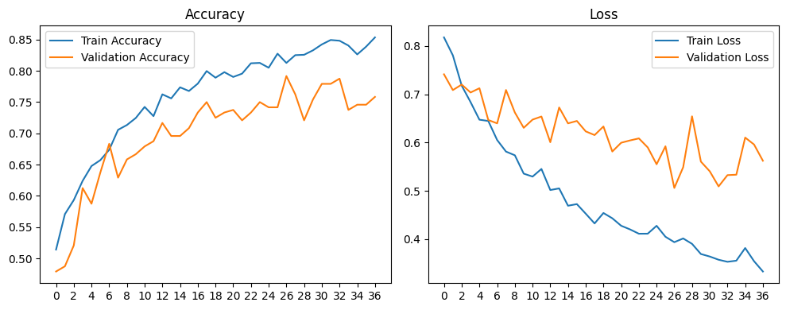

# KT 에이블스쿨 미니프로젝트 (2)

---
## mini 3-1

### 차량 공유업체의 차량 파손 여부 분류

* 목표
    - 차량 공유업체의 이미지를 CNN 모델을 활용해 파손 여부 분류

* 데이터
    - 1 Car_Images.zip
        - 차량 외관 이미지 605개
        - abnormal(비정상, 파손 있음) 또는 normal(정상, 파손 없음)

* 배운 점
    - Data Augmentation - ImageGenerator로 데이터 추가 생성하기
    - InceptionV3 전이 학습 방법
    - Google Colab 활용 방법

* InceptionV3 Train History

|Model|Accuracy|F1_Score|
|-|-|-|
|**AlexNet**|0.7541|0.7000|
|**VGG16**|0.4754|0.6322|
|**My_Img320**|0.6885|0.7246|
|**AlexNet_DataAug**|0.5000|0.0000|
|**InceptionV3_DataAug**|0.8279|0.8264|

---
## mini 3-2
